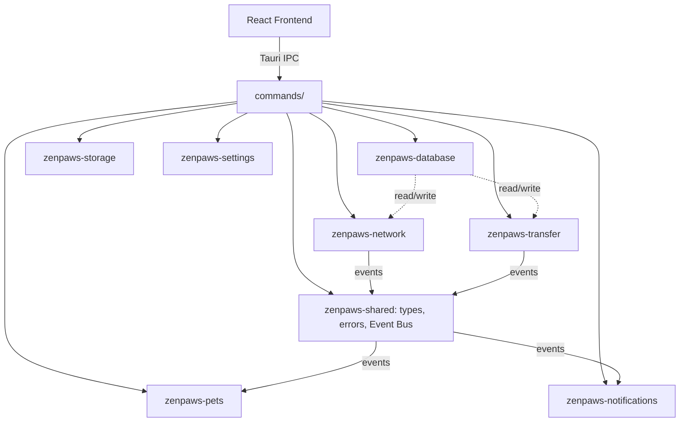

# 04 - System Architecture

## Top-level shape

```
┌─────────────────────────────┐        ┌──────────────────────────────────┐
│   React 19 Frontend (src/)   │ Tauri  │   Rust Backend (src-tauri/)       │
│  Zustand + TanStack Query    │◄──IPC─►│  thin commands/ → crates/*        │
│  Motion animations           │ events │  tokio runtime                    │
└─────────────────────────────┘        └──────────────────────────────────┘
```

The frontend never talks to the network, filesystem, or database directly -
only through Tauri commands exposed by `src-tauri/src/commands/`, which
delegate to the internal crates. This is what makes the per-window
capability scoping in `12_SECURITY_MODEL.md` meaningful: a window can only
reach what its capability file grants, regardless of what the frontend code
tries to call.

## Internal crate graph



Solid arrows: direct calls. Dashed: data dependency, not control coupling.
Note that `NET`, `PETS`, `XFER`, and `NOTIF` never call each other directly
- only through the Event Bus in `zenpaws-shared`, per
`25_EVENT_BUS_ARCHITECTURE.md`.

## Why a Cargo workspace instead of Tauri "modules"

Tauri v2 doesn't have a first-class module system beyond plugins; the
idiomatic way to get real separation of concerns in a Tauri app of this size
is a Cargo workspace with the binary crate (`src-tauri`) as a thin shell
over internal library crates. Each `zenpaws-*` crate is independently unit-
testable without a Tauri runtime. See `05_TECHNICAL_DECISIONS.md` for the
alternatives considered.

## Where things live

| Concern | Location |
|---|---|
| UI components/hooks/state | `src/` |
| IPC surface (thin) | `src-tauri/src/commands/` |
| Business logic | `src-tauri/crates/zenpaws-*` |
| Tauri app config, window defs | `src-tauri/tauri.conf.json` |
| Per-window permissions | `src-tauri/capabilities/*.json` |
| Pet assets | `assets/pets/<pet>/` (added in Phase 4) |

## Data flow example: sending a text message

1. UI calls the `send_message` Tauri command with a typed payload.
2. `commands/chat.rs` validates shape, calls `zenpaws-database` to persist
   locally (source of truth is local-first - see `27_SYNC_REPLICATION_MODEL.md`),
   then calls `zenpaws-network` to broadcast the message envelope.
3. `zenpaws-network` publishes a `MessageSent` event on the Event Bus.
4. `zenpaws-pets` subscribes and may trigger a "celebrate" pet state;
   `zenpaws-notifications` subscribes for the receiving peers' side.
5. The frontend receives a Tauri event and updates the TanStack Query cache
   optimistically, reconciled once the local DB write is confirmed.
