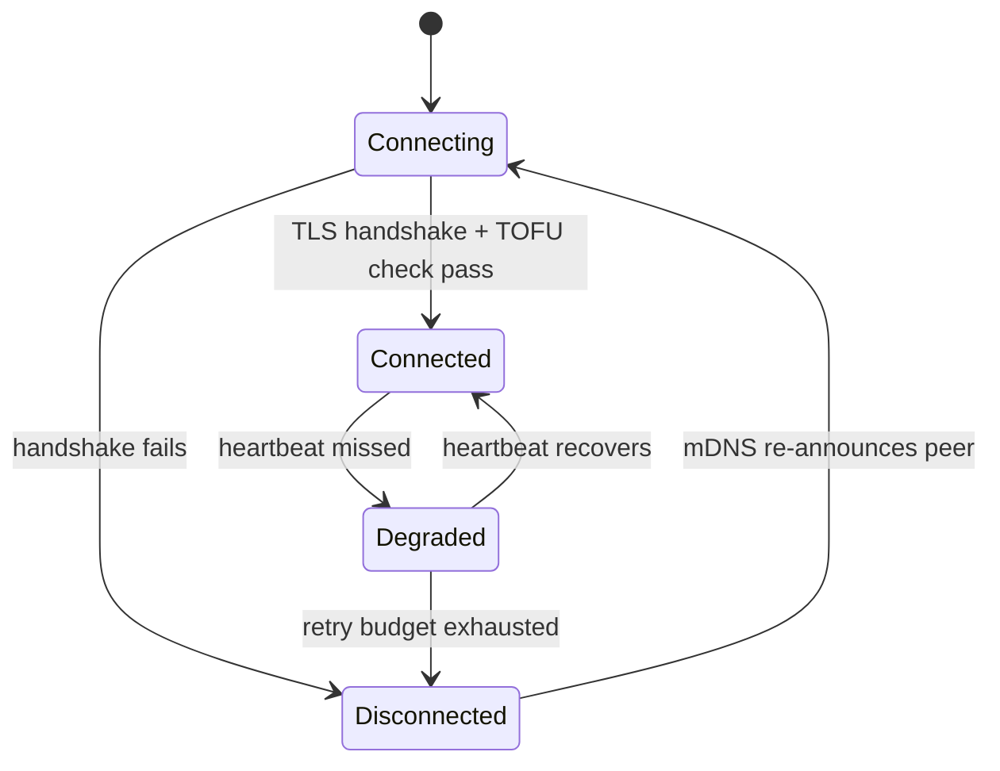

# 06 - Network Architecture

LAN only. No cloud, no relay, no external servers.

## Discovery

`mdns-sd` advertises each peer as `_zenpaws._tcp.local` with TXT records for
`uuid`, `username`, and protocol version. Discovery is push-based (mDNS
announcements + queries), not polling. UDP broadcast is the fallback path
for networks where multicast is filtered.

## Identity

UUID + username + avatar, generated on first launch and persisted in
`zenpaws-settings`. **IP address is a transport detail only** - DHCP can
reassign it at any time, so it is never used as a peer identity key
anywhere in the codebase (database keys, UI display, dedup logic, etc.).

## Transport

TCP with a binary protocol (see `07_MESSAGE_PROTOCOL.md`) rather than
WebSocket - this is a native Rust-to-Rust peer link with no browser
involved, so WebSocket's HTTP upgrade handshake and framing overhead buys
nothing here.

## Connection state machine

- **Heartbeat**: periodic ping over the open TCP connection; missing N
  consecutive heartbeats moves the peer to `Degraded`.
- **Retry with backoff**: exponential backoff on reconnect attempts, capped,
  to avoid hammering a peer that's genuinely offline.
- No polling beyond the heartbeat interval; no port scanning - peers are
  only ever contacted at addresses learned via mDNS.

## Protocol versioning

Every message envelope carries a 1-byte protocol version, independent of
the per-message Lamport logical-clock versioning used for replication
(`27_SYNC_REPLICATION_MODEL.md`). A peer on an older protocol version is
detected at handshake time and shown as "incompatible version" rather than
silently misinterpreting frames.

## Delivery semantics

Given hostless replication (no server to be the source of truth for
"delivered"), these are defined explicitly rather than left implicit:

- **Sent**: the local peer has persisted the message and queued it for
  broadcast.
- **Delivered**: acknowledged by at least one other currently-connected
  peer (not necessarily the final recipient, in the shared-room case).
- **Read**: supported for direct messages only, acknowledged by the other
  recipient. Shared-room messages do not send or display read receipts.

This owner-approved definition is locked for Phase 2 implementation.

## LAN scale target

Up to ~50 concurrent peers. The heartbeat interval, retry backoff caps, and
mDNS query interval are tuned in `13_PERFORMANCE_GUIDELINES.md` to keep
aggregate LAN traffic low at that scale.
