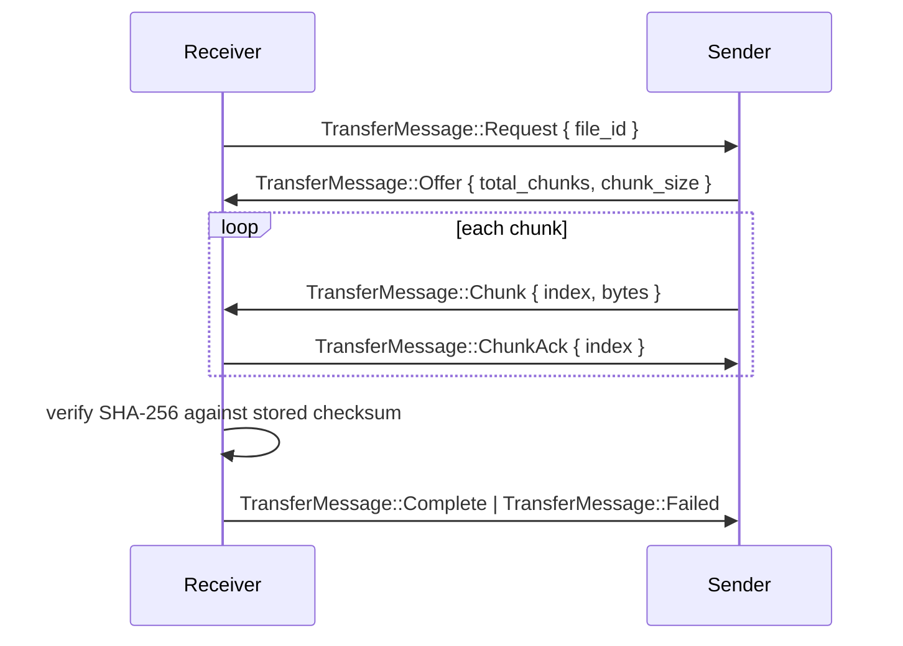

# 08 - File Transfer Protocol

Implemented by the dedicated `zenpaws-transfer` crate - never coupled to
chat logic (the chat system only ever sees file *metadata*; the transfer
system is what moves bytes).

## Metadata (sent automatically with the message)

Stored in SQLite (`09_DATABASE_SCHEMA.md`) and included in the
`MessagePayload`: `fileId`, `messageId`, `senderId`, `mimeType`, `size`,
`checksum` (SHA-256), `createdAt`, `originalFilename`, `storedFilename`
(UUID-based).

## Content transfer flow (non-image files)

Images differ only in that the `Request` is sent automatically by the
receiver on message arrival (auto-transfer, up to the 25MB threshold in
`05_TECHNICAL_DECISIONS.md`) instead of waiting for a user click.

## Chunking

Fixed chunk size (tuned in Phase 7 against real LAN throughput; default
starting point 256KB). Each chunk is acknowledged individually, which is
what makes pause/resume possible - resume simply re-requests from the last
acknowledged chunk index rather than restarting the whole transfer.

## Pause / resume / cancel

- **Pause**: receiver stops sending `ChunkAck`; sender stops sending new
  chunks after a short in-flight window, keeps the send state alive.
  **Resume**: receiver re-sends the last acked index, sender continues.
- **Cancel**: either side sends `TransferMessage::Cancel`; partial data on
  the receiver's side is deleted, not left as a truncated file.

## Integrity validation

Full-file SHA-256 checked after the last chunk lands, before the file is
moved out of the temporary transfer staging area (`26_STORAGE_STRATEGY.md`)
into its final downloads location. A checksum mismatch triggers
`TransferMessage::Failed`, not a silently-corrupt file.

## Upload limit

2 GB per file (from `05_TECHNICAL_DECISIONS.md`). The sender rejects an
attach attempt above this before any transfer begins, with a clear reason
shown to the user - not a silent truncation.