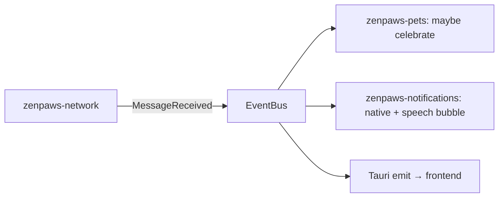

# 25 - Event Bus Architecture

## Why

`zenpaws-network`, `zenpaws-pets`, `zenpaws-transfer`, and
`zenpaws-notifications` never call each other's functions directly - they
publish and subscribe through an event bus owned by `zenpaws-shared`. This
is what lets the pet engine keep working with chat disabled, and what keeps
any one crate's internals from leaking into another's.

## Backend implementation

A typed `EventBus` wrapping `tokio::sync::broadcast`, defined once in
`zenpaws-shared`:

```rust
pub enum ZenPawsEvent {
    PeerConnected { peer_uuid: Uuid },
    PeerDisconnected { peer_uuid: Uuid },
    MessageReceived { message_id: Uuid, room: RoomTarget },
    MessageSent { message_id: Uuid },
    TransferProgress { file_id: Uuid, percent: u8 },
    TransferComplete { file_id: Uuid },
    PetStateChanged { pet_instance: Uuid, state: PetState },
}
```

Each crate that needs to react to events holds a `Receiver<ZenPawsEvent>` and
matches on the variants it cares about - no crate needs to know who
published an event, only the shared enum shape.

## Frontend bridge

The Rust side re-emits relevant `ZenPawsEvent` variants as Tauri events
(`app.emit("zenpaws://event", payload)`); the frontend has one typed event
registry (`src/app/events.ts`) mapping each Tauri event name to its exact
TypeScript payload type - no `any` on either side of that bridge, per
`15_AI_AGENT_RULES.md`.

## Example flows



## What the bus is not

Not a general-purpose message queue with persistence or replay - it's an
in-process pub/sub for decoupling modules within one running app instance.
Cross-peer messaging is the LAN protocol (`07_MESSAGE_PROTOCOL.md`), a
separate concern entirely.
