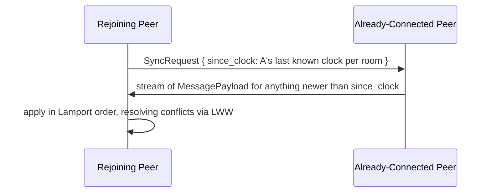

# 27 - Sync & Replication Model

## Hostless replication

There is no server. Every peer stores the full shared-room history (subject to whatever local retention the user configures - unbounded by default), its DM histories, and its own settings. This is what "hostless" means here: no peer is more authoritative than another by role, only by clock ordering (below).

## Message versioning: Lamport logical clocks

Each peer maintains a local counter. Every message/edit/delete carries `(peer_uuid, counter)` as its Lamport clock, incremented on every local event and updated to `max(local, received) + 1` on receiving a remote event - the standard Lamport rule, giving a total, consistent ordering across peers without synchronized wall clocks.

## Conflict resolution: last-write-wins by Lamport clock

When two peers concurrently edit or delete the same message, the edit with the higher `(counter, peer_uuid)` tuple (peer_uuid as tiebreaker) wins and becomes the visible state. The losing edit is retained in local storage, not deleted - it's simply not what's rendered as current - so a future "edit history" feature isn't foreclosed, even though it's not in this build's scope.

**Why LWW and not a CRDT**: messages here are simple field-level edits (text content, deleted flag), not concurrently-merged structured data like collaborative text. A CRDT would solve a merge problem this app doesn't have - per the ponytail ladder, the simpler mechanism that correctly handles the actual conflict shape wins.

## Sync-on-reconnect (late join / catch-up)

A rejoining peer sends its last-known clock per room to every peer it reconnects to; each connected peer streams back anything newer. If multiple peers respond with overlapping history, duplicates are detected by message `id` and simply not reapplied - idempotent by construction.

## What this deliberately doesn't solve

A peer that's offline for a very long time relative to how much history other peers have pruned (if/when retention limits are added later) may have gaps; this build ships with unbounded local retention specifically to avoid that edge case for now - revisit this doc first if retention limits are ever introduced.